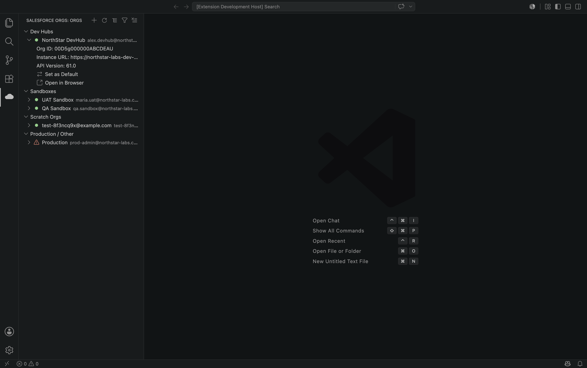
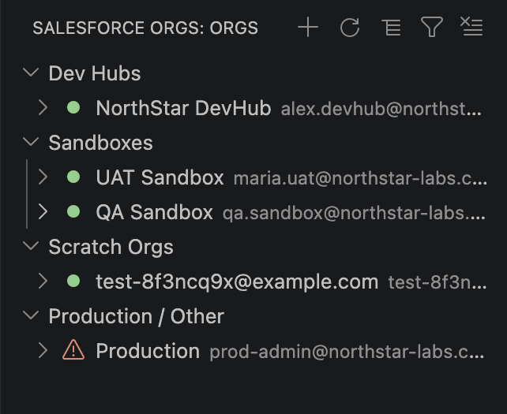
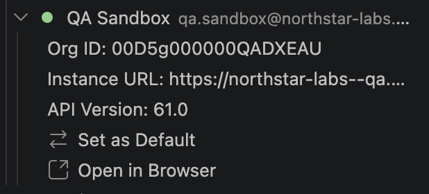
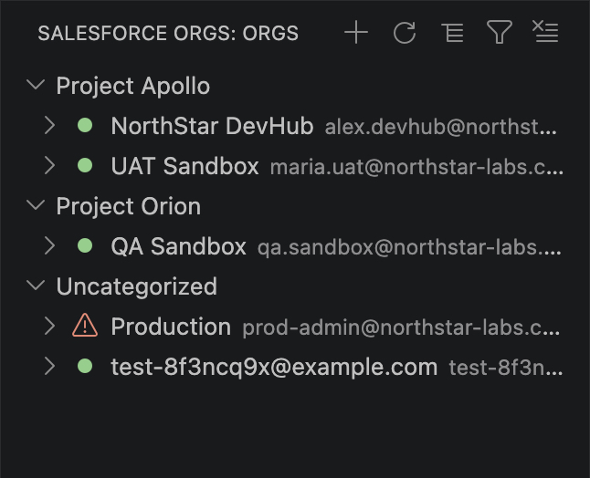
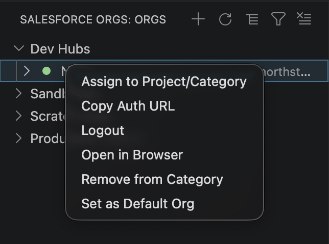

# ☁️ Salesforce Org Manager

Manage every Salesforce org you've authorized with the `sf` CLI — right from a dedicated view in VS Code's Activity Bar. Browse, authorize, categorize, and act on your orgs without ever leaving the editor or memorizing CLI flags.

## ✨ Features

### 🗂️ Org Explorer, grouped automatically

Every org you've authorized via `sf org login web` shows up automatically, grouped by type:

- 🏢 **Dev Hubs**
- 🧪 **Sandboxes**
- 🌱 **Scratch Orgs**
- 🚀 **Production / Other**

A status dot next to each org shows at a glance whether it's connected 🟢 or needs re-authentication 🔴.

Expand any org to see its details — Org ID, Instance URL, API version, expiration date for scratch orgs — plus quick actions, no `sf org display` required.

### 🔑 Authorize new orgs without touching the terminal

Click **➕** in the view's title bar, pick Production / Sandbox / Custom URL, optionally set an alias, and let the extension drive `sf org login web` for you — complete with a progress notification while you finish logging in through the browser.

### 🏷️ Organize orgs your way

Tag orgs with your own project/category labels, then switch the whole tree between **grouping by type** and **grouping by category** with one click. Filter the tree down to a single category when you only want to see the orgs for the project you're currently working on.

### ⚡ Manage orgs from the right-click menu

Right-click any org for the full set of actions:

| Action | What it does |
| --- | --- |
| 🎯 **Set as Default Org** | Runs `sf config set target-org` so this org becomes your CLI default. |
| 🌐 **Open in Browser** | Opens the org directly, logged in. |
| 🏷️ **Assign to Project/Category** | Tag the org with a new or existing category. |
| ➖ **Remove from Category** | Clear an org's category assignment. |
| 🚪 **Logout** | Deauthorizes the org (with a confirmation prompt). |
| 📋 **Copy Auth URL** | Copies the org's SFDX Auth URL to your clipboard — see the security note below. |

Orgs with an expired token also get an inline ↻ **Refresh Token** action so you can reauthenticate in one click.

## 📋 Requirements

- [Salesforce CLI](https://developer.salesforce.com/tools/salesforcecli) (`sf`) installed and available on your `PATH`.

The extension checks for this on activation and links straight to the install docs if it's missing.

## 🚀 Getting Started

1. Install the extension and make sure `sf --version` works in your terminal.
2. Click the ☁️ **Salesforce Orgs** icon in the Activity Bar.
3. Already have orgs authorized? They'll show up immediately, grouped by type.
4. Click ➕ to authorize your first org, or right-click any org to explore the available actions.

## 🔒 A note on "Copy Auth URL"

The SFDX Auth URL is a full credential — equivalent to a refresh token — that lets anyone who has it authenticate as that org without a browser or MFA. **Treat a copied Auth URL exactly like a password**: don't paste it into chat messages, tickets, or shared documents. The extension never caches this value in memory; it's fetched fresh from the CLI each time you copy it.

## ⚙️ Extension Settings

None yet — the extension works out of the box with no configuration required. Category assignments are stored locally at `~/.sf-org-manager/categories.json`.

## ⚠️ Known Limitations

- Category/project tags are stored per-machine, not synced across devices or shared with a team.
- The extension talks to whatever `sf` CLI is on your `PATH` — behavior depends on your installed CLI version.

## 📄 License

[MIT](LICENSE)
